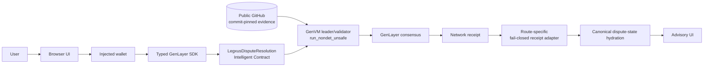

# LegxusAI Architecture

LegxusAI is an advisory dispute workflow whose authoritative lifecycle lives in a GenLayer Intelligent Contract. The browser provides user interaction and wallet requests; it does not calculate or persist an authoritative verdict.

## End-to-end flow

The verified public demonstration follows:

`file_dispute` → respondent `accept_dispute` → `evaluate` → GenVM leader/validator execution → consensus-backed receipt → canonical `FINALIZED` state → advisory result display.

## Responsibility boundaries

### User, browser, and wallet

The browser collects dispute context and commit-pinned public evidence references. It validates evidence metadata and retrieves the bytes before signing, then re-verifies selected references immediately before a lifecycle write. An evidence-free action requires explicit confirmation. The injected wallet is responsible for account and chain authorization; the browser never receives or stores a private key.

The browser reads canonical state through the typed SDK and may keep only a versioned, chain/contract/state-scoped cache when a canonical refresh is unavailable. A successful canonical read always supersedes cache data. Local storage is not a transaction index and never becomes the source of a verdict.

### Typed GenLayer SDK and receipt adapter

`src/lib/genlayer/disputes.ts` constructs canonical calldata for filing, acceptance, decline, and evaluation, enforces role/status guards, uses `value: 0n`, retains full transaction hashes, and requests a canonical refresh after a validated write.

`src/lib/genlayer/transactions.ts` validates status, full-hash binding, consensus, execution, return envelopes, messages, and triggered transactions. The route is selected from the configured network:

- Studio reads `consensus_data.leader_receipt` and decodes the verified GenLayer calldata return.
- Bradbury uses the separate hash-bound `debugTraceTransaction({ hash, round: 0 })` route with `transaction_id`, `result_code`, and non-empty hexadecimal `return_data` checks.

The adapter never silently falls back between receipt shapes, predicts dispute IDs, matches titles or latest records, or fabricates transaction history. Studio accepts only the exact reviewed quorum-short-circuit validator marker; all other malformed or failed validator records fail closed.

### Intelligent Contract

The contract performs deterministic lifecycle checks before nondeterministic evaluation:

- Filing records the claimant's criteria and validated evidence metadata.
- Only the named respondent can accept or decline an `AWAITING_RESPONDENT` dispute.
- Only the named claimant or respondent can evaluate a `READY_FOR_EVALUATION` dispute.
- Persistent evaluation fields are written only after consensus returns a validated advisory result.

Reference amounts and currencies are context only. The contract has no asset transfer, escrow, fee, bond, payout, or settlement path.

### GenVM nondeterministic boundary

During `evaluate`, storage values are copied into local inputs before entering `gl.vm.run_nondet_unsafe`. Both the leader and validator independently execute the evaluation function. Each execution retrieves and verifies the public evidence inside the nondeterministic boundary, normalizes the model result, and exposes structured evidence/source metadata. The validator compares its independent result with the leader result using the contract's result-equivalence rules.

This boundary is the reason GenLayer is essential here: a conventional deterministic contract cannot itself retrieve changing external web content and perform model-based interpretation. GenLayer supplies the Intelligent Contract execution environment and consensus over those independent executions; the resulting state is still explicitly advisory rather than a financial or legal enforcement mechanism.

### Consensus, receipt, and canonical state

GenLayer consensus produces the transaction result and execution receipts. The application accepts a lifecycle result only after the route-specific adapter validates the public receipt and confirms no messages or child transactions were emitted. Return values are decoded strictly as a canonical dispute ID, boolean success, or one of the three allowed advisory outcomes.

After a successful receipt, the application reads `get_state_version()` and canonical dispute records from the contract. The verified Studio demonstration ends with `DISPUTE_STATE_V3`, `DSP-0001`, `FINALIZED`, `RESPONDENT_ACCEPTED`, a non-empty evaluation timestamp, and `UNDETERMINED`.

## Trust boundaries

1. **Browser boundary:** user input, wallet state, and external HTTP responses are untrusted. Browser verification is a pre-signing safeguard, not authoritative adjudication.
2. **Wallet boundary:** signing is controlled by the owner and the injected provider. Role and chain checks are repeated immediately before signing and by the contract.
3. **External evidence boundary:** URLs, bytes, MIME types, and hashes are public data. The contract-side leader and validator independently retrieve and hash the references inside `run_nondet_unsafe`.
4. **GenVM/consensus boundary:** leader and validator executions may observe external/model nondeterminism; consensus and result-equivalence checks determine whether persistent state may be updated.
5. **Receipt boundary:** the adapter treats network projections as untrusted input and fails closed on hash mismatches, failed execution, malformed calldata, disagreements, messages, or triggered transactions.
6. **Canonical-state boundary:** contract reads are authoritative. A scoped cache can preserve usability during a read outage but cannot override a successful canonical response.

## Explicitly out of scope

The verified architecture does not include Bradbury deployment evidence, protocol appeals, application-level appeal substitutes, escrow, settlement, fees, bonds, stakes, payouts, transfers, financial finality, or a backend/indexer that invents transaction history. The current result is advisory-only, and public evidence availability depends on the referenced GitHub provider and network access.

For public receipt/state invariants and the exact Studio hashes, see [GENLAYER_VALIDATION.md](GENLAYER_VALIDATION.md). For evidence retrieval and metadata policy, see [evidence-policy.md](evidence-policy.md).
